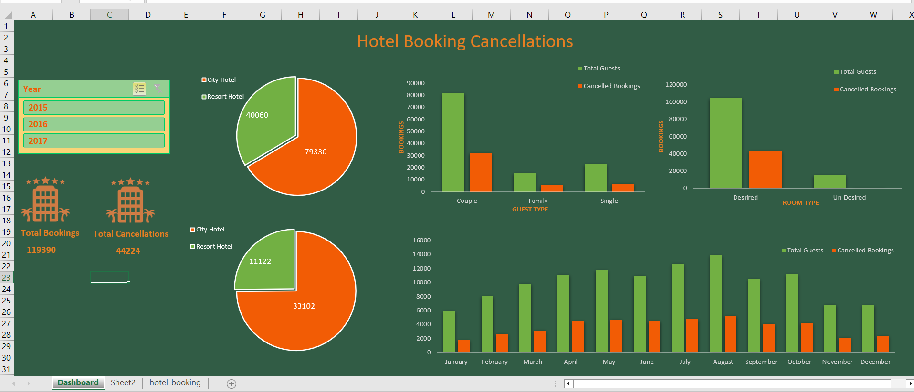

# Hotel Booking Cancellation Analysis Project

## 📊 Project Overview
This project analyzes hotel booking data from 2015 to 2017 to uncover the key factors contributing to booking cancellations. Using Microsoft Excel, I created a comprehensive dashboard with visual insights powered by pivot tables and slicers.



## 🧠 Objective
Identify the primary reasons for booking cancellations and understand how factors like room assignment, guest type, and booking month influence cancellations.

## 🛠️ Steps Performed
- **Data Cleaning & Transformation:** Added new columns (`room_status`, `guest_type`) using Excel formulas (`IF`, `AND`).
- **Pivot Tables & Charts:** Built 5 pivot tables and linked them to slicers for dynamic year-wise analysis.
- **Dashboard Creation:** Designed a visually appealing dashboard to display insights with pie and bar charts.

## 📈 Key Insights
1. **Guest Type vs Cancellations:**
   - Couples had the highest number of bookings (81,560) but also significant cancellations (32,424).
2. **Room Assignment Impact:**
   - When guests received their desired room, cancellations were lower (43,422 out of 104,473).
3. **Monthly Cancellations:**
   - Cancellations peaked during summer months (May–August).
4. **Hotel Type Comparison:**
   - City Hotels had more bookings (79,330) and higher cancellations (33,102) compared to Resort Hotels.

## 🚀 Tools & Techniques
- **Microsoft Excel:** Data cleaning, pivot tables, charts, and slicers.
- **Formulas Used:** `IF`, `AND`, conditional formatting.

## 📂 Project Structure
```
|-- hotel_booking.xlsx
|-- Dashboard.png
|-- README.md
```

## 🏁 Conclusion
This analysis highlights that factors like room allocation, booking season, and guest type significantly affect cancellations. These insights can help hotels improve customer satisfaction and reduce cancellations by optimizing room assignments and targeting promotions during high-cancellation periods.

---

The snapshot of the dashboard is attached in the below link.


